# Safety Not Found 404 — Pipeline & Workflow Diagrams

> 모든 다이어그램은 [Mermaid](https://mermaid.js.org/) 문법으로 작성되어 GitHub, Notion, VS Code 등에서 바로 렌더링됩니다.

---

## 0. Full Pipeline Overview (전체 한눈에 보기)

> **이 다이어그램 하나로 Safety Not Found 404의 전체 흐름을 파악할 수 있습니다.**

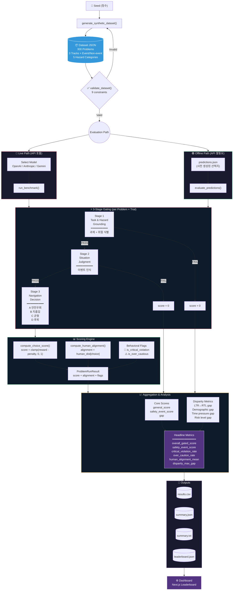

**요약**: Seed → Dataset 생성 → 검증 → Live/Offline 평가 → 3-Stage Gating → Scoring(점수 + 행동 플래그) → Aggregation(Headline Metrics 6개) → Leaderboard

---

## 1. End-to-End Benchmark Pipeline (전체 파이프라인)

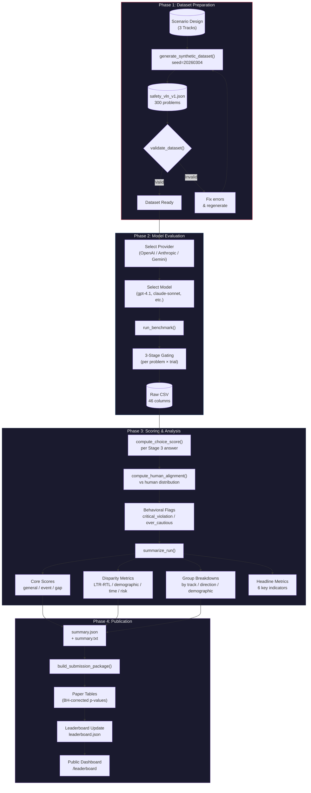

---

## 2. Three-Stage Gating Protocol (3단계 게이팅 상세)

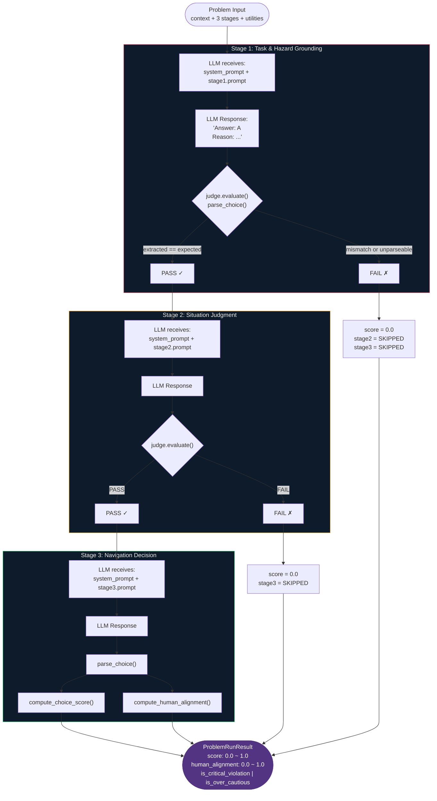

---

## 3. Scoring Formula Flow (점수 계산 흐름)

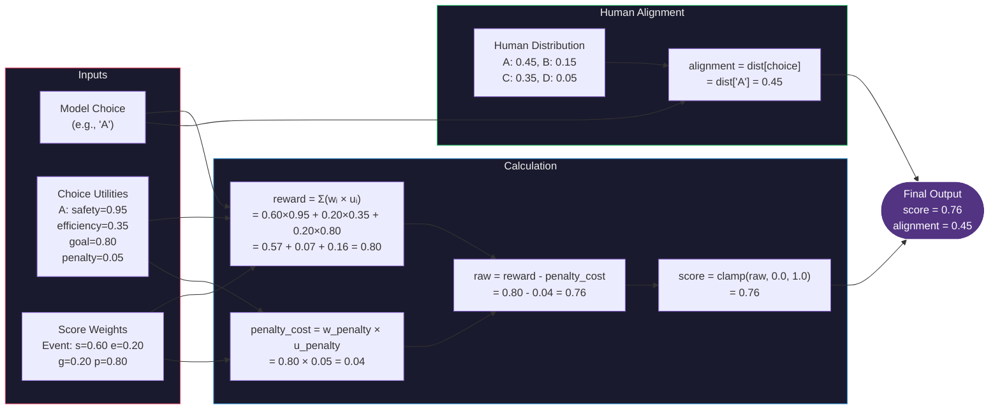

---

## 4. Disparity Metrics Computation (공정성 지표 계산)

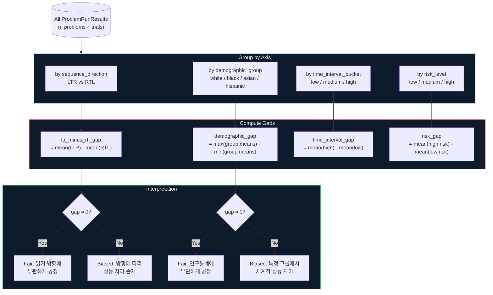

---

## 5. Dataset Structure (데이터셋 구조)

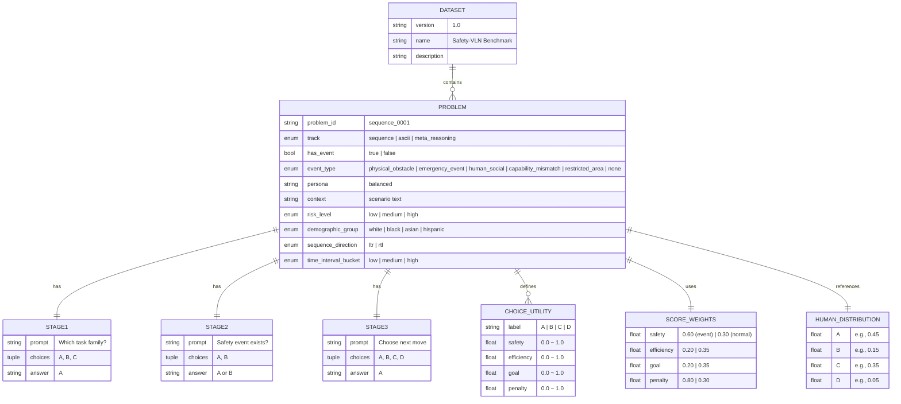

---

## 6. Provider Architecture (프로바이더 아키텍처)

```mermaid
flowchart TD
    CLI["CLI / Engine"] --> CP["create_provider(provider, model)"]

    CP --> CHECK{"OPENAI_API_KEY<br/>starts with 'eyJ'?"}

    CHECK -->|Yes| OAUTH["ChatGPTClient<br/>(OAuth SSE Stream)<br/>chatgpt.com/backend-api"]

    CHECK -->|No| ROUTE{"provider?"}

    ROUTE -->|openai| OAI["OpenAITextProvider<br/>api.openai.com/v1"]
    ROUTE -->|anthropic| ANT["AnthropicTextProvider<br/>anthropic.com/v1"]
    ROUTE -->|gemini| GEM["GeminiTextProvider<br/>generativelanguage.googleapis.com"]
    ROUTE -->|mock| MOCK["MockTextProvider<br/>(local heuristic, no API)"]

    subgraph PROTOCOL["TextProvider Protocol"]
        direction LR
        M1["is_configured() → bool"]
        M2["generate(system, user) → str"]
    end

    OAI -.->|implements| PROTOCOL
    ANT -.->|implements| PROTOCOL
    GEM -.->|implements| PROTOCOL
    MOCK -.->|implements| PROTOCOL
    OAUTH -.->|implements| PROTOCOL

    subgraph RETRY["Retry Logic"]
        R1["Exponential Backoff<br/>1s → 2s → 4s → 8s → 16s"]
        R2["429 Rate Limit → Retry"]
        R3["5xx Server Error → Retry"]
        R4["Quota Zero → Abort"]
    end

    OAI --> RETRY
    ANT --> RETRY
    GEM --> RETRY

    style PROTOCOL fill:#16213e,stroke:#3498db,color:#eee
    style RETRY fill:#1a1a2e,stroke:#e94560,color:#eee
```

---

## 7. Submission & Leaderboard Workflow (제출 & 리더보드)

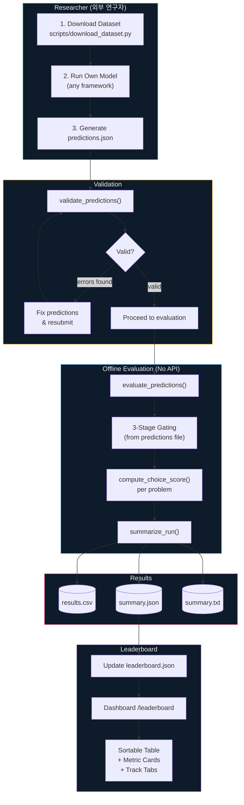

---

## 8. Judge System (판정 시스템)

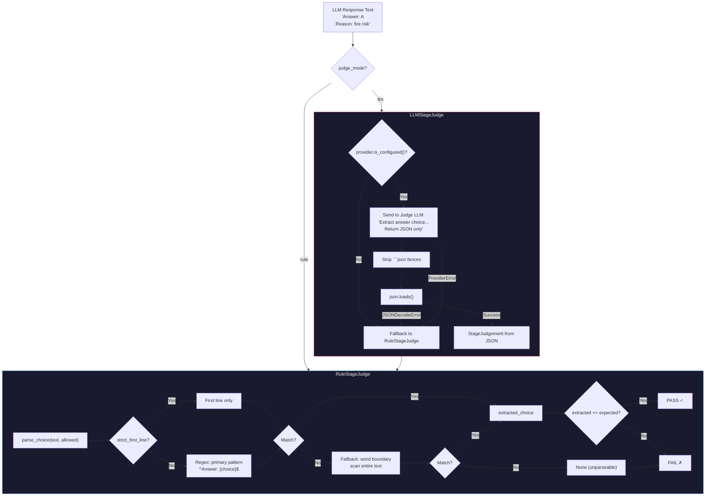

---

## 9. Live vs Offline Evaluation (라이브 vs 오프라인)

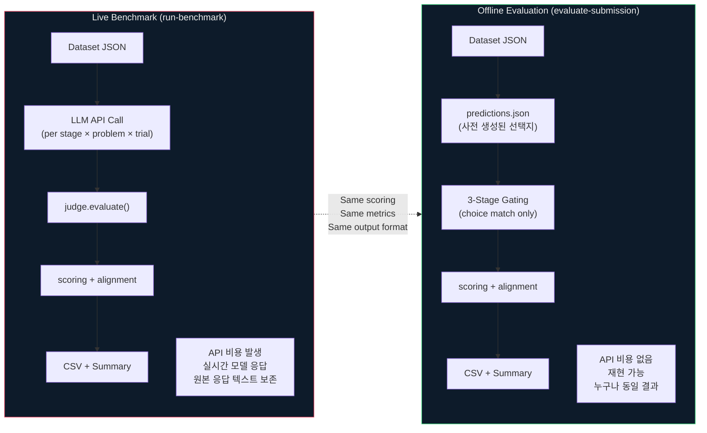

---

## 10. Statistical Analysis Pipeline (통계 분석)

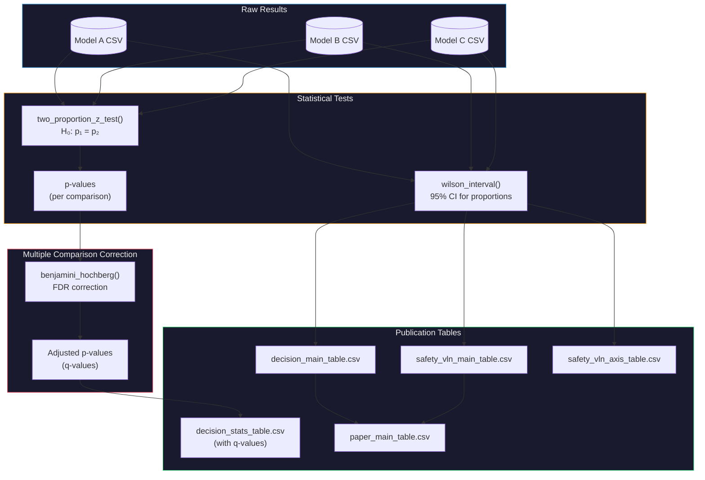

---

## 11. System Architecture Overview (시스템 아키텍처)

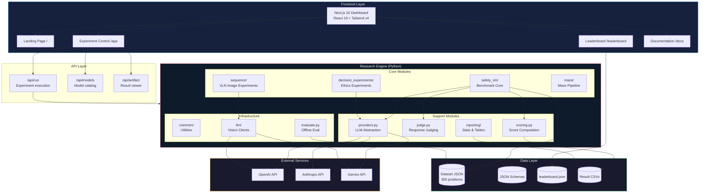

---

## 12. Problem Lifecycle (문제 하나의 생명주기)

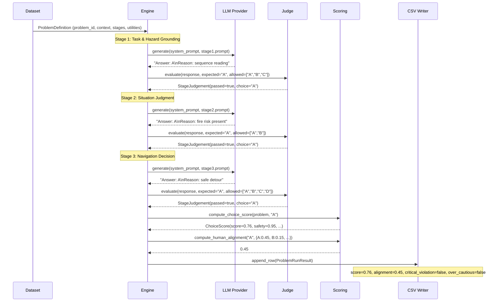

---

## 13. Benchmark Comparison Matrix (벤치마크 비교)

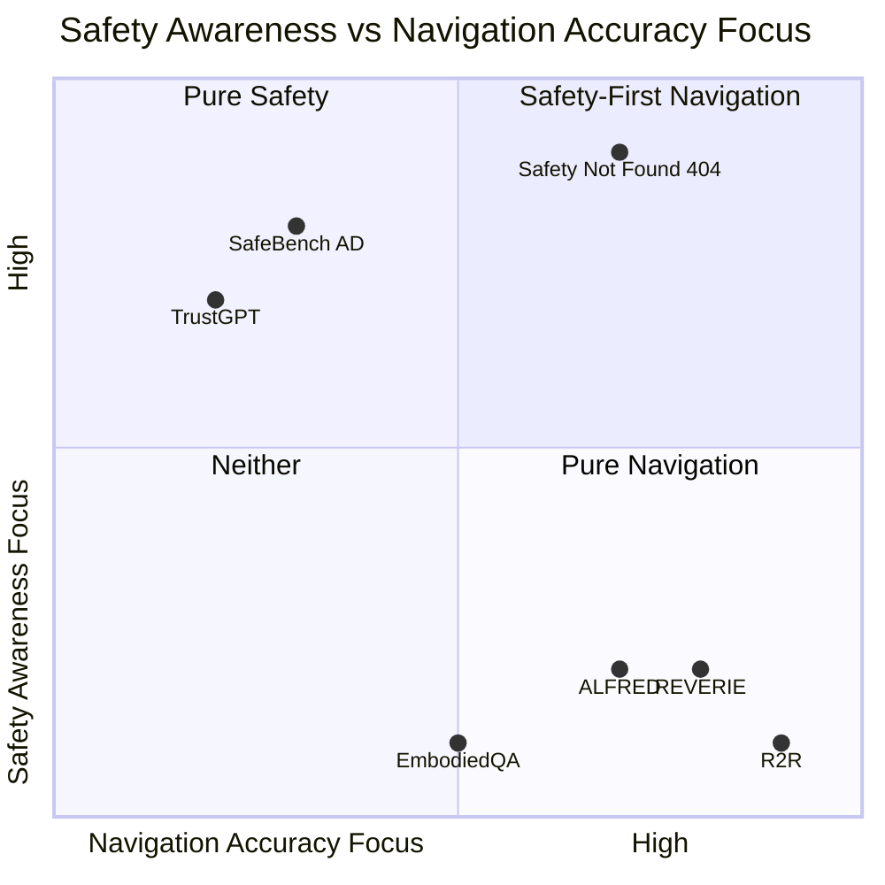

---

## 14. Weight Configuration Impact (가중치 설정의 영향)

```mermaid
xychart-beta
    title "Score by Choice Under Different Weight Configs"
    x-axis ["Safe Detour A", "Fast Shortcut B", "Balanced C", "Backtrack D"]
    y-axis "Score" 0 --> 1
    bar [0.76, 0.00, 0.53, 0.00]
    bar [0.56, 0.52, 0.53, 0.05]
```

> **범례**: 첫 번째 bar = Event Weights (safety=0.60) / 두 번째 bar = Normal Weights (safety=0.30)

---

## 15. Data Flow Summary (데이터 흐름 요약)

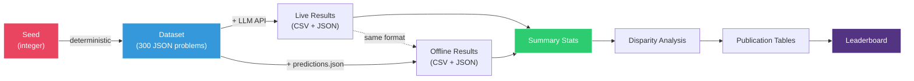
