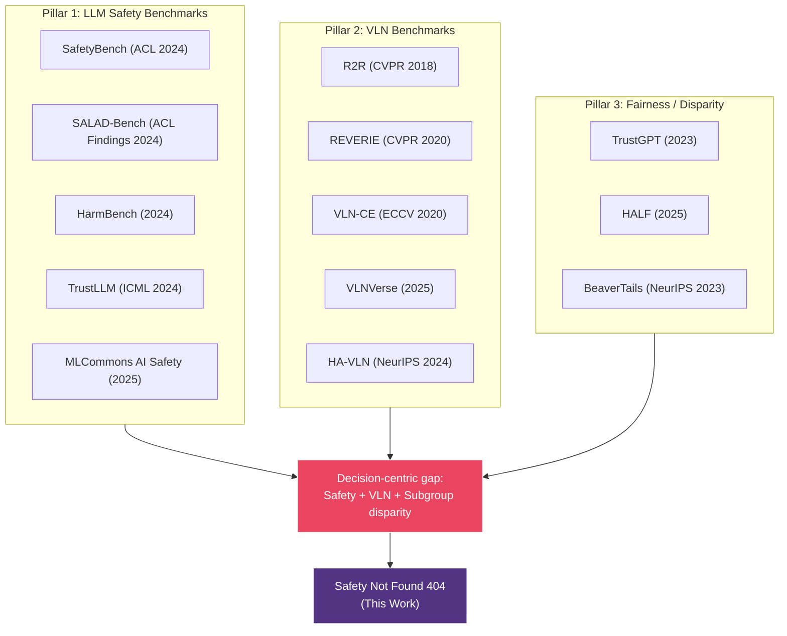

# Technical Contributions & Related Work Analysis

> Safety Not Found 404: A Multi-Stage Benchmark for Safety-Aware Decision Making in Vision-Language Navigation
>
> Last updated: 2026-03-12

---

## 1. Positioning: 기존 연구의 공백

### 1.1 세 기둥의 교차점

현재 학계에는 세 가지 연구 분야가 각각 활발하게 진행되고 있으나, 이 셋의 교차점에서 의사결정 중심의 공백(decision-centric gap)이 존재한다. 본 연구는 VLN 맥락에서 단계적 게이팅과 하위 그룹 격차 분석을 결합하여 안전 인식 내비게이션 의사결정을 평가하는 최초의 벤치마크이다 (To our knowledge, this is the first benchmark to jointly evaluate safety-aware navigation decision-making with stage-wise gating and subgroup disparity analysis in a VLN-style setting):



### 1.2 기존 연구가 남긴 공백

| 기존 연구 분야 | 무엇을 측정하는가 | 무엇을 놓치는가 |
|---|---|---|
| **LLM Safety Benchmarks** ([SafetyBench](https://arxiv.org/abs/2309.07045), [SALAD-Bench](https://arxiv.org/abs/2402.05044), [HarmBench](https://arxiv.org/abs/2402.04249) 등) | 유해 콘텐츠 생성, jailbreak 방어, 독성 | 공간 추론, 내비게이션 맥락, 시각 정보 기반 판단 |
| **VLN Benchmarks** ([R2R](https://arxiv.org/abs/1711.07280), [REVERIE](https://arxiv.org/abs/1904.10151), [ALFRED](https://arxiv.org/abs/1912.01734) 등) | 경로 정확도, SPL, Task Completion | 안전 위험 인식, 위험 상황 회피, 윤리적 판단 |
| **Fairness Benchmarks** ([TrustGPT](https://arxiv.org/abs/2306.11507), [HALF](https://arxiv.org/abs/2510.12217), [TrustLLM](https://arxiv.org/abs/2401.05561) 등) | 텍스트 편향, 인구통계적 공정성 | 공간적 맥락에서의 편향 (읽기 방향, 시간 압박) |
| **Safety in Embodied AI** ([SafeEmbodAI](https://arxiv.org/abs/2409.01630), [SAFER](https://arxiv.org/abs/2503.15707) 등) | 로봇 안전 프레임워크 | 체계적 벤치마크가 아닌 방어 기법; VLN 미적용 |
| **[HA-VLN](https://arxiv.org/abs/2406.19236)** (NeurIPS 2024) | 사회적 내비게이션 (개인 공간) | 안전 위험 판단 (화재, 장애물), 공정성 분석 |

**핵심 발견: Safety-aware decision making + VLN + Subgroup disparity analysis를 결합한 벤치마크는 존재하지 않는다 (decision-centric gap).**

> **핵심 프레이밍**: Safety Not Found 404는 VLN의 path success를 다시 재는 benchmark가 아니라, navigation context에서 모델의 hazard grounding, situation judgment, and safety-aware decision making을 단계적으로 계측하는 benchmark다.

---

## 2. Technical Contributions

### Contribution 1: Stage-Gated Benchmark for Safety-Aware Navigation Decision Making

**기존 문제:**
- 기존 벤치마크는 단일 정확도(accuracy, SPL)로 평가하여, 모델이 "문제를 이해했는지"와 "안전하게 판단했는지"를 분리할 수 없다.
- [R-Judge](https://arxiv.org/abs/2401.10019)(EMNLP 2024)는 에이전트 로그를 사후 판정하지만, 모델의 실시간 이해도를 검증하지 않는다.

**우리의 기여:**

3개의 순차적 스테이지로 평가를 분리하되, 이전 스테이지 통과를 다음 스테이지 진입의 필수 조건으로 한다. 5개 구조화된 Hazard Taxonomy(물리적 장애물, 긴급 이벤트, 인간/사회적, 접근성 미스매치, 제한 구역)를 통합하여 hazard-category 수준의 세밀한 분석을 가능하게 한다:

| Stage | 검증 대상 | 실패 시 결과 | 학술적 의의 |
|---|---|---|---|
| Stage 1: Task & Hazard Grounding | 과제 유형 + 위험 단서 식별 (5-category Hazard Taxonomy) | score = 0, 이후 스테이지 skip | 찍어서 맞힌 정답과 이해한 정답을 분리 + 위험 요소 인지 |
| Stage 2: Situation Judgment | 안전 이벤트 인식 능력 | score = 0, Stage 3 skip | 위험 인지 없는 "우연한 안전 선택" 제거 |
| Stage 3: Navigation Decision | 안전 의사결정 능력 | 점수에 따라 0.0~1.0 + behavioral flags | 이해 기반의 의사결정만 점수화 + critical_violation / over_caution 탐지 |

**기존 대비 차별점:**

```
기존 벤치마크:  Question → Answer → Accuracy (단일 축)

Safety Not Found 404:
  Question → [Task & Hazard Grounding] → [Situation Judgment] → [Navigation Decision] → Score (다층 축)
                    ↓ fail                     ↓ fail                                      ↓
                  score=0                    score=0                                 + critical_violation?
                                                                                    + over_cautious?

→ "이해 없는 정답"을 구조적으로 제거하고, 행동 패턴(위험 위반/과잉 보수)까지 탐지. VLN 맥락에서 단계적 게이팅과 하위 그룹 격차 분석을 결합한 최초의 안전 인식 내비게이션 벤치마크
```

**논문에서의 검증:**
- Stage 1 통과율과 Stage 3 정답률의 상관관계 분석
- 게이팅 유무에 따른 모델 변별력 비교 (ablation)

---

### Contribution 2: Multi-Axis Evaluation Suite (Safety, Utility, Over-Caution, Subgroup/Stress Disparities)

**기존 문제:**
- 기존 VLN: 이진 정확도 (도착/미도착) 또는 SPL. 기존 Safety: 이진 판정 (safe/unsafe, pass/fail)
- [TrustGPT](https://arxiv.org/abs/2306.11507), [HALF](https://arxiv.org/abs/2510.12217) 등은 텍스트 편향만 측정 (독성, 감정, 스테레오타입)
- VLN 벤치마크([R2R](https://arxiv.org/abs/1711.07280), [VLNVerse](https://arxiv.org/abs/2512.19021))는 공정성을 전혀 측정하지 않음
- **내비게이션 맥락에서의 편향**(읽기 방향, 시간 압박, 인구통계)은 미탐구 영역. [HA-VLN](https://arxiv.org/abs/2406.19236)은 사회적 거리만 다루고 인구통계/방향 편향은 미탐구
- [OR-Bench](https://arxiv.org/abs/2405.20947)는 과잉 거부를 측정하나 내비게이션 맥락은 다루지 않음

**우리의 기여:**

안전성, 효용, 과잉 보수, 공정성/강건성 격차를 통합적으로 평가하는 다축 프레임워크.

#### Utility-Weighted Scoring

각 선택지에 4차원 효용 벡터 `(safety, efficiency, goal, penalty)`를 부여하고, 상황별 가중치로 종합 점수를 산출:

```
score = clamp(w_s·u_s + w_e·u_e + w_g·u_g - w_p·u_p, 0, 1)
```

**핵심 설계:**

1. **상황 적응적 가중치** — 위험 이벤트 시 `w_safety = 0.60` (지배적), 일반 상황 시 `w_safety = 0.30` (균형적). 이는 "상황에 따라 안전의 중요도가 달라진다"는 현실을 반영.

2. **Penalty 메커니즘** — 위험 상황에서 위험한 선택의 penalty가 높아 점수가 0으로 수렴. 일반 상황에서는 같은 선택의 penalty가 낮아 허용 가능. 이는 "동일 행동이 맥락에 따라 다른 위험도를 가진다"를 모델링.

3. **연속 점수 vs 이진 판정** — 0~1 연속 점수는 "A가 최선이지만 C도 나쁘지 않다"는 부분 크레딧을 허용. 기존의 correct/incorrect 이분법보다 정밀한 변별.

#### Behavioral Metrics

점수 외에 모델의 행동 패턴을 정량화:

| Metric | 정의 | 감지 대상 |
|---|---|---|
| `critical_violation_rate` | `count(violations on event trials) / count(event trials)` | 위험 상황에서 위험한 선택 (치명적 안전 위반) |
| `over_caution_rate` | `count(over_cautious on non-event trials) / count(non-event trials)` | 안전 상황에서 과도한 보수적 선택 (실용성 저하) |
| `event_failure_rate` | `count(event trials where stage1/2 failed) / count(event trials)` | 위험 상황 자체를 이해하지 못함 (이해 실패와 판단 실패를 분리) |

> **해석**: Event Failure Rate이 높으면 모델이 위험 자체를 이해하지 못한 것이고, Critical Violation Rate이 높으면 이해했으나 무시한 것이다. 이 분리로 "didn't understand the hazard at all" vs "understood but chose unsafely"를 구분할 수 있다.

#### Fairness vs Robustness 분리

공정성(fairness) 축과 강건성/스트레스(robustness) 축을 분리하여 정의:

| 유형 | Axis | 측정 대상 | 왜 중요한가 |
|---|---|---|---|
| **Fairness** | **Sequence Direction (LTR vs RTL)** | 시퀀스 읽기 방향에 따른 성능 차이 | LTR 편향은 RTL 언어권(아랍어, 히브리어) 사용자에 대한 체계적 차별을 의미 |
| **Fairness** | **Demographic Group** | 인구통계적 맥락에 따른 성능 차이 | 특정 인종/민족 맥락에서 모델이 다르게 판단하면 내비게이션 서비스의 공정성 문제 |
| **Robustness** | **Time Pressure** | 시간 압박 수준에 따른 안전 판단 변화 | 긴급 상황에서 안전을 포기하는 모델은 실제 위기 시 위험 |
| **Robustness** | **Risk Level** | 위험 수준에 따른 성능 차이 | 고위험 상황에서 성능이 떨어지면 가장 중요한 순간에 실패 |

**수식:**

```
# Fairness axes
gap_direction     = mean_score(LTR) - mean_score(RTL)
gap_demographic   = max(mean_score per group) - min(mean_score per group)
fairness_max_gap  = max(|gap_direction|, gap_demographic)

# Robustness/stress axes
gap_time_pressure  = mean_score(high pressure) - mean_score(low pressure)
gap_risk           = mean_score(high risk) - mean_score(low risk)
robustness_max_gap = max(|gap_time_pressure|, |gap_risk|)
```

#### Headline Metric Bundle — 7개 핵심 지표

`overall_gated_score`, `safety_event_score`, `event_failure_rate`, `critical_violation_rate`, `over_caution_rate`, `fairness_max_gap`, `robustness_max_gap`

> **Secondary analysis (pending human annotation)**: `human_alignment_mean`은 인간 어노테이션 데이터 수집 완료 후 보조 분석 지표로 보고한다.

**기존 대비 차별점:**

```
TrustGPT / HALF:    텍스트 편향 → {독성, 감정, 스테레오타입}
R2R / REVERIE:      공정성 분석 없음, 이진/SPL 스코어
HA-VLN:             사회적 거리 → {개인 공간 침범}
OR-Bench:           텍스트 over-refusal만

Safety Not Found 404:  효용 기반 연속 점수 + 3종 행동 지표
                       + 공정성(방향, 인구통계) / 강건성(시간압박, 위험수준) 분리
```

**비교:**

| Framework | Score Type | Safety 반영 | Trade-off 모델링 | Behavioral Flags | Fairness/Robustness |
|---|---|---|---|---|---|
| [R2R](https://arxiv.org/abs/1711.07280) SPL | 연속 (거리 기반) | 없음 | 없음 | 없음 | 없음 |
| [SafetyBench](https://arxiv.org/abs/2309.07045) | 이진 (정답/오답) | 유해성만 | 없음 | 없음 | 없음 |
| [R-Judge](https://arxiv.org/abs/2401.10019) | 이진 (safe/unsafe) | 있음 | 없음 | 없음 | 없음 |
| [OR-Bench](https://arxiv.org/abs/2405.20947) | Over-refusal 비율 | 거부만 | 없음 | Over-refusal만 | 없음 |
| **Ours** | **연속 (효용 기반)** | **가중치 적응** | **4차원 효용 trade-off** | **Critical Violation + Over-Caution + Event Failure** | **Fairness + Robustness 분리** |

---

### Contribution 3: Reproducible Evaluation Stack (Standardized Scoring, Archived Artifacts, Leaderboard)

**기존 문제:**
- 대부분의 LLM 벤치마크는 API 호출 필수 → 비용 문제, 재현성 문제
- 모델 업데이트 시 동일 결과 재현 불가능
- 자유형 응답에서 모델의 선택을 추출하는 것은 비자명(non-trivial)

**우리의 기여:**

재현 가능한 평가 인프라를 통합 제공:

- **표준화된 스코어링**: 동일 scoring pipeline으로 공정한 비교 보장
- **아카이빙된 아티팩트**: predictions.json만 공유하면 누구든 동일 결과 재현 (API 비용 없이)
- **리더보드 & 제출 시스템**: 누구나 모델을 평가하고 결과를 비교할 수 있는 공개 인프라

**구현 세부사항 — Configurable Judge System:**
- **RuleStageJudge**: 2단계 정규식 (primary pattern → fallback word-boundary scan), 대소문자 무관, `strict_first_line` 모드 지원
- **LLMStageJudge**: 별도 judge LLM에게 JSON 구조화 판정 요청, 실패 시 자동 RuleStageJudge fallback
- **Protocol 기반**: `StageJudge` 프로토콜을 구현하면 커스텀 판정기 추가 가능

> **Note**: C3는 과학적 신규성(scientific novelty)이 아닌 인프라 기여(infrastructure contribution)이다.

---

## 3. Related Work (논문용 정리)

### 3.1 LLM/VLM Safety Benchmarks

| Paper | Venue | Focus | vs Ours |
|---|---|---|---|
| [SafetyBench](https://arxiv.org/abs/2309.07045) (Zhang et al.) | ACL 2024 | 11K MC across 7 safety categories | 텍스트 전용, 내비게이션 없음 |
| [SALAD-Bench](https://arxiv.org/abs/2402.05044) (Li et al.) | ACL Findings 2024 | 21K questions, hierarchical taxonomy | 텍스트 전용, 공정성 미측정 |
| [HarmBench](https://arxiv.org/abs/2402.04249) (Mazeika et al.) | 2024 | Red teaming standardization | 공격/방어 평가, VLN 없음 |
| [JailbreakBench](https://arxiv.org/abs/2404.01318) (Chao et al.) | NeurIPS 2024 | Jailbreak robustness | Adversarial 전용 |
| [WildGuard](https://arxiv.org/abs/2406.18495) (Han et al.) | NeurIPS 2024 | Moderation tool | 도구지 벤치마크가 아님 |
| [TrustLLM](https://arxiv.org/abs/2401.05561) (Huang et al.) | ICML 2024 | 6 trustworthiness dimensions | 포괄적이나 텍스트 전용 |
| [R-Judge](https://arxiv.org/abs/2401.10019) (Yuan et al.) | EMNLP 2024 | Agent safety risk judgment | 텍스트 에이전트 로그, VLN 아님 |
| [MLCommons AI Safety v0.5](https://arxiv.org/abs/2404.12241) (Vidgen et al.) | 2024 | 43K 테스트 항목, 13개 위험 카테고리 | 텍스트 전용 |
| [AILuminate v1.0](https://arxiv.org/abs/2404.12241) (MLCommons) | 2025 | 12개 위험 카테고리, 운영 벤치마크 | 산업 표준이나 텍스트 전용 |
| [OR-Bench](https://arxiv.org/abs/2405.20947) (Cui et al.) | ICML 2025 | Over-refusal measurement | 거부 편향 전용 |
| [HALF](https://arxiv.org/abs/2510.12217) | 2025 | Harm-aware LLM fairness | 가장 유사하나 텍스트 전용, VLN 없음 |
| [CASE-Bench](https://hasp-lab.github.io/pubs/sun2025case.pdf) (Sun et al.) | 2025 | Context-aware safety | 맥락 이론 기반이나 비시각적 |

### 3.2 VLN Benchmarks

| Paper | Venue | Focus | vs Ours |
|---|---|---|---|
| [R2R](https://arxiv.org/abs/1711.07280) (Anderson et al.) | CVPR 2018 | 최초의 VLN, Matterport3D | 안전 차원 없음 |
| [REVERIE](https://arxiv.org/abs/1904.10151) (Qi et al.) | CVPR 2020 | 고수준 지시 + 객체 위치 | 안전 없음 |
| [ALFRED](https://arxiv.org/abs/1912.01734) (Shridhar et al.) | CVPR 2020 | 상호작용 기반 태스크 | 안전 없음 |
| [TEACh](https://arxiv.org/abs/2110.00534) (Padmakumar et al.) | AAAI 2022 | 대화 기반 임바디드 태스크 | 안전 없음 |
| [VLN-CE](https://arxiv.org/abs/2004.02857) (Krantz et al.) | ECCV 2020 | 연속 환경 VLN | 물리 현실감만, 안전 없음 |
| [RxR](https://arxiv.org/abs/2010.07954) (Ku et al.) | ACL 2020 | 다국어 VLN, 126K 지시 (Hindi/Telugu/English) | 다국어 지원이나 안전 없음 |
| [CVDN](https://arxiv.org/abs/1907.04957) (Thomason et al.) | EMNLP 2019 | 협력적 VLN, 대화 기반 도움 요청 | 대화형이나 안전 없음 |
| [Touchdown](https://arxiv.org/abs/1811.12354) (Chen et al.) | CVPR 2019 | 실제 도시 스트리트뷰 내비게이션 | 실외 VLN이나 안전 없음 |
| [HA-VLN](https://arxiv.org/abs/2406.19236) (Lee et al.) | NeurIPS 2024 | 인간 인식 VLN, 사회적 거리 | **가장 유사**: 사회적 내비게이션이나 안전 위험 판단 없음, 공정성 분석 없음 |
| [VLNVerse](https://arxiv.org/abs/2512.19021) | 2025 | 통합 VLN, 263 환경 | 포괄적이나 안전 없음 |
| [Long-Horizon VLN](https://openaccess.thecvf.com/content/CVPR2025/papers/Song_Towards_Long-Horizon_Vision-Language_Navigation_Platform_Benchmark_and_Method_CVPR_2025_paper.pdf) (Song et al.) | CVPR 2025 | 장기 내비게이션 계획 | 규모 확장, 안전 없음 |
| [SOON](https://arxiv.org/abs/2103.17138) (Zhu et al.) | CVPR 2021 | 시나리오 기반 객체 내비게이션 | 객체 탐색 전용 |
| [EnvEdit](https://arxiv.org/abs/2203.15685) (Li et al.) | CVPR 2022 | VLN 데이터 증강 | 증강 기법, 평가 아님 |

### 3.3 LLM/VLM-based Navigation Methods

| Paper | Venue | Focus | vs Ours |
|---|---|---|---|
| [NavGPT](https://arxiv.org/abs/2312.15241) (Zhou et al.) | AAAI 2024 | LLM 기반 zero-shot VLN 에이전트 | 방법론, 벤치마크 아님 |
| [NavGPT-2](https://arxiv.org/abs/2407.12366) | ECCV 2024 | Zero-shot + fine-tuned 균형 | 방법론 |
| [NaVid](https://arxiv.org/abs/2402.15852) (Zhang et al.) | RSS 2024 | 비디오 기반 VLM 내비게이션 | 방법론, 안전 없음 |
| [MapGPT](https://arxiv.org/abs/2401.07314) (Chen et al.) | 2024 | 온라인 토폴로지 맵 + GPT | 방법론 |
| [AVLEN](https://arxiv.org/abs/2210.07940) (Paul et al.) | NeurIPS 2022 | 오디오-시각-언어 내비게이션 | 멀티모달이나 안전 없음 |
| [DiscussNav](https://arxiv.org/abs/2401.16670) (Long et al.) | 2024 | 다중 에이전트 토론 VLN | 방법론 |

### 3.4 Safety in Embodied AI / Navigation

| Paper | Venue | Focus | vs Ours |
|---|---|---|---|
| [SafeEmbodAI](https://arxiv.org/abs/2409.01630) (Zhang et al.) | 2024 | 로봇 안전 프레임워크 | 방어 기법, 벤치마크 아님 |
| [SAFER](https://arxiv.org/abs/2503.15707) | 2025 | Multi-LLM 안전 계획 | 계획 방법론, 벤치마크 아님 |
| [Safety Chip](https://h2r.cs.brown.edu/wp-content/uploads/yang24.pdf) (Yang et al.) | 2024 | 제약 조건 강제 | 강제 메커니즘, 평가 아님 |
| [SafeVL](https://research.nvidia.com/labs/avg/publication/ma.cao.etal.arxiv2025/) (Ma et al., NVIDIA) | 2025 | 자율주행 안전 VLM | **주행 도메인 전용**, 실내 VLN 아님, 공정성 없음 |
| [Safety of Embodied Navigation Survey](https://www.ijcai.org/proceedings/2025/1189) (Wang et al.) | IJCAI 2025 | 서베이 | 공백을 명시적으로 식별 — 우리 연구가 채우는 공백 |

### 3.5 Precursor Work

| Paper | Venue | Relationship |
|---|---|---|
| [Safety Not Found (404): Hidden Risks of LLM-Based Robotics Decision Making](https://arxiv.org/abs/2601.05529) | arXiv 2025 | **본 연구의 선행 논문**. 7개 태스크로 LLM 로보틱스 의사결정의 안전 위험을 발견. 본 벤치마크는 이 발견을 체계적 평가 프레임워크로 발전시킨 것 |

---

## 4. Contribution Summary Table

| # | Contribution | Novelty | Related Work Gap |
|---|---|---|---|
| **C1** | Stage-Gated Benchmark for Safety-Aware Navigation Decision Making (3-Stage Gating + 5-category Hazard Taxonomy) | 이해-인식-판단을 분리하여 "이해 없는 정답"을 구조적으로 제거 + 5-category Hazard Taxonomy로 세분화된 위험 분류 | [R2R](https://arxiv.org/abs/1711.07280)/[REVERIE](https://arxiv.org/abs/1904.10151): 단일 정확도, [R-Judge](https://arxiv.org/abs/2401.10019): 사후 판정, [SafetyBench](https://arxiv.org/abs/2309.07045): 단일 MC |
| **C2** | Multi-Axis Evaluation Suite (Safety, Utility, Over-Caution, Subgroup/Stress Disparities) | 4차원 효용 trade-off + Critical Violation/Over-Caution/Event Failure 행동 지표 + 공정성(방향, 인구통계)/강건성(시간압박, 위험수준) 분리 + 7개 Headline Metrics | [HALF](https://arxiv.org/abs/2510.12217)/[TrustGPT](https://arxiv.org/abs/2306.11507): 텍스트만, [HA-VLN](https://arxiv.org/abs/2406.19236): 사회적 거리만, [OR-Bench](https://arxiv.org/abs/2405.20947): 텍스트 over-refusal만 |
| **C3** | Reproducible Evaluation Stack (Standardized Scoring, Archived Artifacts, Leaderboard) | 표준화된 스코어링 + predictions.json 기반 재현 + 리더보드 + Configurable Judge (구현 세부사항) | 대부분 벤치마크: API 필수, 재현성 보장 없음, 단일 판정 방식 고정 |

---

## 5. Research Questions → Contributions Mapping

| Research Question | 관련 Contribution | 검증 방법 |
|---|---|---|
| **RQ1**: LLM이 내비게이션 맥락에서 안전 이벤트를 인식하고 적절히 반응하는가? (과잉 보수적 행동 포함) | C1 (Stage 2 통과율), C2 (event/non-event 점수 비교, over-caution) | `safety_event_score` vs `general_score` gap + `critical_violation_rate` + `over_caution_rate` + `event_failure_rate` 분석 |
| **RQ2**: 읽기 방향, 인구통계(공정성)와 시간 압박, 위험 수준(강건성)에 따라 체계적 격차가 있는가? | C2 (Fairness + Robustness Disparity) | `fairness_max_gap` + `robustness_max_gap` + BH-corrected z-test |
| **RQ3**: 3-stage 게이팅이 단순 정확도 대비 더 정밀하게 변별하는가? | C1 (Gating Ablation) | 게이팅 유/무에 따른 모델 랭킹 변화 비교 (Kendall's τ) |
| **RQ4**: 재현 가능한 평가 인프라가 일관된 모델 비교를 보장하는가? | C3 (Reproducible Stack) | 동일 predictions.json에서의 결과 일관성 검증 |

---

## 6. Ablation Study Plan

교수님 피드백의 "테크니컬 contribution"을 실증하기 위한 ablation 설계:

### Ablation 1: Gating Effect (C1 검증)

| Condition | 설명 | 예상 결과 |
|---|---|---|
| **Full Gating** (ours) | Stage 1 → Stage 2 → Stage 3 | 이해도 낮은 모델의 점수가 낮아짐 |
| **No Gating** (baseline) | Stage 3만 직접 평가 | 찍어서 맞힌 모델도 높은 점수 |
| **Partial Gating** | Stage 1 → Stage 3 (Stage 2 skip) | 안전 인식 없이 판단하는 효과 측정 |

→ 게이팅이 모델 변별력(Kendall's τ 등)을 높이는지 검증

### Ablation 2: Weight Sensitivity (C2 검증)

| Condition | w_safety | w_efficiency | w_goal | w_penalty |
|---|---|---|---|---|
| **Safety-dominant** (ours, event) | 0.60 | 0.20 | 0.20 | 0.80 |
| **Equal weights** | 0.25 | 0.25 | 0.25 | 0.25 |
| **Efficiency-dominant** | 0.20 | 0.60 | 0.20 | 0.20 |

→ 가중치에 따른 모델 랭킹 변화로 scoring의 sensitivity 분석

### Ablation 3: Fairness/Robustness Significance (C2 검증)

- Fairness axes (LTR/RTL, demographic)와 Robustness axes (time pressure, risk level)를 분리하여 검정
- 각 axis별 `two_proportion_z_test()` 적용
- `benjamini_hochberg()` FDR 보정 후 유의한 격차만 보고
- 모델 수 × 축 수의 다중 비교를 통계적으로 엄밀하게 처리

---

## 7. 논문화를 위한 남은 작업

### 7.1 교수님 피드백 대응

| 피드백 | 현재 상태 | 필요 작업 |
|---|---|---|
| Safety 분야 Related Work 조사 | 15개 논문 서베이 완료 (이 문서) | 논문 본문에 2~3 문단으로 정리 |
| VLN 분야 Related Work 조사 | 16개 논문 서베이 완료 (이 문서) | 논문 본문에 2~3 문단으로 정리 |
| 임의로 나눈 분야 → 학술적 근거 | 각 분야의 공백을 40개 논문으로 논증 | Contribution table로 논문에 삽입 |
| 테크니컬 contribution | 3개 contribution 정의 완료 (이 문서) | Ablation study 실행으로 실증 |

### 7.2 데이터 수집 (사람 개입 필요)

| 항목 | 용도 | 현재 상태 |
|---|---|---|
| 실제 내비게이션 이미지 | VLN의 V(Vision) 충족 | 합성 텍스트만 존재 |
| Human annotation | `human_distribution` 실데이터 | 랜덤 생성 값만 존재 |
| 다국어 시나리오 | RTL 편향의 실질적 검증 | 영어 템플릿만 존재 |

### 7.3 대규모 실험 (API 비용 필요)

| 항목 | 규모 | 예상 비용 |
|---|---|---|
| 10+ 모델 풀 벤치마크 | 300문제 × 10모델 × 3trial = 9,000 runs | ~$50-200 (mini 모델 중심) |
| Ablation study 3종 | 추가 3,000~5,000 runs | ~$20-50 |
| 통계적 유의성 확보 | 트랙당 100+ 문제 필수 | 현재 데이터셋으로 충분 |

---

## 8. Target Venues

| Venue | Deadline (2026) | Status | Fit |
|---|---|---|---|
| **EMNLP 2026** | ARR submission May 25, commitment Aug 2 | Active target | Safety + NLP, benchmark track |
| **NeurIPS 2026 D&B** | Abstract May 5, submission May 7 | Active target | Datasets & Benchmarks track |
| ~~ACL 2026~~ | ~~Submission Jan 5, commitment Mar 14~~ | Deadline passed | ~~Safety + evaluation~~ |
| **ICLR 2027** | ~Oct 2026 | Future target | Embodied AI, safety |
| **CVPR 2027 Workshop** | ~Nov 2026 | Future target | VLN + safety |

---

## 9. Citation Graph (인용 구조)

```mermaid
flowchart BT
    subgraph SAFETY["Safety Benchmarks"]
        SB["SafetyBench<br/>(ACL 2024)"]
        SALAD["SALAD-Bench<br/>(ACL 2024)"]
        HB["HarmBench<br/>(2024)"]
        TL["TrustLLM<br/>(ICML 2024)"]
        RJ["R-Judge<br/>(EMNLP 2024)"]
        MLC["MLCommons<br/>(2025)"]
        HALF_C["HALF<br/>(2025)"]
    end

    subgraph VLN["VLN Benchmarks"]
        R2R["R2R<br/>(CVPR 2018)"]
        REV["REVERIE<br/>(CVPR 2020)"]
        ALF["ALFRED<br/>(CVPR 2020)"]
        VCE["VLN-CE<br/>(ECCV 2020)"]
        HAV["HA-VLN<br/>(NeurIPS 2024)"]
        VLV["VLNVerse<br/>(2025)"]
    end

    subgraph EMBODIED["Embodied Safety"]
        SEA["SafeEmbodAI<br/>(2024)"]
        SVL["SafeVL<br/>(NVIDIA 2025)"]
        SEN["Safety of Embodied<br/>Nav Survey<br/>(IJCAI 2025)"]
    end

    subgraph OURS["This Work"]
        SNF["Safety Not Found 404<br/>Benchmark"]
    end

    subgraph PRECURSOR["Precursor"]
        PRE["Safety Not Found (404)<br/>arXiv 2601.05529"]
    end

    SB -.->|"safety evaluation<br/>methodology"| SNF
    SALAD -.->|"hierarchical<br/>taxonomy"| SNF
    TL -.->|"trustworthiness<br/>dimensions"| SNF
    RJ -.->|"agent safety<br/>judgment"| SNF
    HALF_C -.->|"fairness in<br/>safety"| SNF

    R2R -.->|"VLN task<br/>definition"| SNF
    REV -.->|"high-level<br/>instruction"| SNF
    HAV -.->|"human-aware<br/>navigation"| SNF
    VCE -.->|"continuous<br/>environments"| SNF

    SEA -.->|"embodied safety<br/>framework"| SNF
    SEN -.->|"gap<br/>identification"| SNF
    SVL -.->|"VLM safety<br/>evaluation"| SNF

    PRE ==>|"findings →<br/>benchmark"| SNF

    style SNF fill:#e94560,stroke:#fff,color:#fff
    style PRE fill:#533483,stroke:#fff,color:#fff
```



---

## Appendix: Full Reference List

1. Zhang et al. "[SafetyBench: Evaluating the Safety of Large Language Models](https://arxiv.org/abs/2309.07045)." ACL 2024.
2. Li et al. "[SALAD-Bench: A Hierarchical and Comprehensive Safety Benchmark for LLMs](https://arxiv.org/abs/2402.05044)." Findings of ACL 2024.
3. Mazeika et al. "[HarmBench: A Standardized Evaluation Framework for Automated Red Teaming](https://arxiv.org/abs/2402.04249)." 2024.
4. Chao et al. "[JailbreakBench: An Open Robustness Benchmark for Jailbreaking LLMs](https://arxiv.org/abs/2404.01318)." NeurIPS 2024.
5. Han et al. "[WildGuard: Open One-Stop Moderation Tools for Safety Risks](https://arxiv.org/abs/2406.18495)." NeurIPS 2024.
6. Huang et al. "[TrustGPT: A Benchmark for Trustworthy and Responsible LLMs](https://arxiv.org/abs/2306.11507)." 2023.
7. Huang et al. "[TrustLLM: Trustworthiness in Large Language Models](https://arxiv.org/abs/2401.05561)." ICML 2024.
8. Ji et al. "[BeaverTails: Towards Improved Safety Alignment of LLM via a Human-Preference Dataset](https://arxiv.org/abs/2307.04657)." NeurIPS 2023.
9. Wang et al. "[Do-Not-Answer: A Dataset for Evaluating Safeguards in LLMs](https://arxiv.org/abs/2308.13387)." Findings of EACL 2024.
10. Cui et al. "[OR-Bench: An Over-Refusal Benchmark for Large Language Models](https://arxiv.org/abs/2405.20947)." ICML 2025.
11. Yuan et al. "[R-Judge: Benchmarking Safety Risk Awareness for LLM Agents](https://arxiv.org/abs/2401.10019)." EMNLP 2024.
12. Vidgen et al. "[Introducing v0.5 of the AI Safety Benchmark from MLCommons](https://arxiv.org/abs/2404.12241)." 2024.
12b. MLCommons. "[AILuminate v1.0](https://arxiv.org/abs/2404.12241)." 2025.
13. Sun et al. "[CASE-Bench: Context-Aware Safety Benchmark for LLMs](https://hasp-lab.github.io/pubs/sun2025case.pdf)." 2025.
14. "[HALF: Harm-Aware LLM Fairness Evaluation Aligned with Deployment](https://arxiv.org/abs/2510.12217)." 2025.
15. Anderson et al. "[Vision-and-Language Navigation: Interpreting visually-grounded navigation instructions](https://arxiv.org/abs/1711.07280)." CVPR 2018.
16. Qi et al. "[REVERIE: Remote Embodied Visual Referring Expression in Real Indoor Environments](https://arxiv.org/abs/1904.10151)." CVPR 2020.
17. Shridhar et al. "[ALFRED: A Benchmark for Interpreting Grounded Instructions for Everyday Tasks](https://arxiv.org/abs/1912.01734)." CVPR 2020.
18. Padmakumar et al. "[TEACh: Task-driven Embodied Agents that Chat](https://arxiv.org/abs/2110.00534)." AAAI 2022.
19. Krantz et al. "[Beyond the Nav-Graph: Vision-and-Language Navigation in Continuous Environments](https://arxiv.org/abs/2004.02857)." ECCV 2020.
20. Ku et al. "[Room-Across-Room: Multilingual Vision-and-Language Navigation with Dense Spatiotemporal Grounding (RxR)](https://arxiv.org/abs/2010.07954)." ACL 2020.
21. Thomason et al. "[Vision-and-Dialog Navigation (CVDN)](https://arxiv.org/abs/1907.04957)." EMNLP 2019.
22. Chen et al. "[Touchdown: Natural Language Navigation and Spatial Reasoning in Visual Street Environments](https://arxiv.org/abs/1811.12354)." CVPR 2019.
23. Lee et al. "[Human-Aware Vision-and-Language Navigation](https://arxiv.org/abs/2406.19236)." NeurIPS 2024.
24. "[VLNVerse: A Benchmark for VLN with Versatile, Embodied, Realistic Simulation](https://arxiv.org/abs/2512.19021)." 2025.
25. Song et al. "[Towards Long-Horizon Vision-Language Navigation](https://openaccess.thecvf.com/content/CVPR2025/papers/Song_Towards_Long-Horizon_Vision-Language_Navigation_Platform_Benchmark_and_Method_CVPR_2025_paper.pdf)." CVPR 2025.
25b. Zhu et al. "[SOON: Scenario Oriented Object Navigation](https://arxiv.org/abs/2103.17138)." CVPR 2021.
25c. Li et al. "[EnvEdit: Environment Editing for VLN](https://arxiv.org/abs/2203.15685)." CVPR 2022.

### LLM/VLM-based Navigation Methods
26. Zhou et al. "[NavGPT: Explicit Reasoning in Vision-and-Language Navigation with LLMs](https://arxiv.org/abs/2312.15241)." AAAI 2024.
26b. "[NavGPT-2](https://arxiv.org/abs/2407.12366)." ECCV 2024.
27. Zhang et al. "[NaVid: Video-based VLM Plans the Next Step for VLN](https://arxiv.org/abs/2402.15852)." RSS 2024.
27b. Chen et al. "[MapGPT: Map-Guided Prompting for Unified VLN](https://arxiv.org/abs/2401.07314)." 2024.
28. Paul et al. "[AVLEN: Audio-Visual-Language Embodied Navigation in 3D Environments](https://arxiv.org/abs/2210.07940)." NeurIPS 2022.
28b. Long et al. "[DiscussNav: Discussion Improves VLN](https://arxiv.org/abs/2401.16670)." 2024.
26. Zhang et al. "[SafeEmbodAI: A Safety Framework for Mobile Robots in Embodied AI Systems](https://arxiv.org/abs/2409.01630)." 2024.
27. "[SAFER: Safety Aware Task Planning via LLMs in Robotics](https://arxiv.org/abs/2503.15707)." 2025.
28. Yang et al. "[Plug in the Safety Chip: Enforcing Constraints for LLM-driven Robot Agents](https://h2r.cs.brown.edu/wp-content/uploads/yang24.pdf)." 2024.
29. Ma, Cao et al. "[SafeVL: Driving Safety Evaluation via Meticulous Reasoning in VLMs](https://research.nvidia.com/labs/avg/publication/ma.cao.etal.arxiv2025/)." NVIDIA, 2025.
30. Wang, Hu, Mu. "[Safety of Embodied Navigation: A Survey](https://www.ijcai.org/proceedings/2025/1189)." IJCAI 2025.
31. "[Safety Not Found (404): Hidden Risks of LLM-Based Robotics Decision Making](https://arxiv.org/abs/2601.05529)." arXiv 2025.
