# Technical Contributions & Related Work Analysis

> Safety Not Found 404: A Multi-Stage Benchmark for Safety-Aware Decision Making in Vision-Language Navigation
>
> Last updated: 2026-03-12

---

## 1. Positioning: 기존 연구의 공백

### 1.1 세 기둥의 교차점

현재 학계에는 세 가지 연구 분야가 각각 활발하게 진행되고 있으나, 이 셋을 **동시에** 다루는 연구는 존재하지 않는다:


### 1.2 기존 연구가 남긴 공백

| 기존 연구 분야 | 무엇을 측정하는가 | 무엇을 놓치는가 |
|---|---|---|
| **LLM Safety Benchmarks** (SafetyBench, SALAD-Bench, HarmBench 등) | 유해 콘텐츠 생성, jailbreak 방어, 독성 | 공간 추론, 내비게이션 맥락, 시각 정보 기반 판단 |
| **VLN Benchmarks** (R2R, REVERIE, ALFRED 등) | 경로 정확도, SPL, Task Completion | 안전 위험 인식, 위험 상황 회피, 윤리적 판단 |
| **Fairness Benchmarks** (TrustGPT, HALF, TrustLLM 등) | 텍스트 편향, 인구통계적 공정성 | 공간적 맥락에서의 편향 (읽기 방향, 시간 압박) |
| **Safety in Embodied AI** (SafeEmbodAI, SAFER 등) | 로봇 안전 프레임워크 | 체계적 벤치마크가 아닌 방어 기법; VLN 미적용 |
| **HA-VLN** (NeurIPS 2024) | 사회적 내비게이션 (개인 공간) | 안전 위험 판단 (화재, 장애물), 공정성 분석 |

**핵심 발견: Safety + VLN + Fairness를 동시에 다루는 벤치마크는 존재하지 않는다.**

---

## 2. Technical Contributions

### Contribution 1: Three-Stage Gating Evaluation Protocol

**기존 문제:**
- 기존 벤치마크는 단일 정확도(accuracy, SPL)로 평가하여, 모델이 "문제를 이해했는지"와 "안전하게 판단했는지"를 분리할 수 없다.
- R-Judge(EMNLP 2024)는 에이전트 로그를 사후 판정하지만, 모델의 실시간 이해도를 검증하지 않는다.

**우리의 기여:**

3개의 순차적 스테이지로 평가를 분리하되, 이전 스테이지 통과를 다음 스테이지 진입의 필수 조건으로 한다:

| Stage | 검증 대상 | 실패 시 결과 | 학술적 의의 |
|---|---|---|---|
| Stage 1: Exam Understanding | 문제 유형 인식 능력 | score = 0, 이후 스테이지 skip | 찍어서 맞힌 정답과 이해한 정답을 분리 |
| Stage 2: Situation Understanding | 안전 이벤트 인식 능력 | score = 0, Stage 3 skip | 위험 인지 없는 "우연한 안전 선택" 제거 |
| Stage 3: Navigation Decision | 안전 의사결정 능력 | 점수에 따라 0.0~1.0 | 이해 기반의 의사결정만 점수화 |

**기존 대비 차별점:**

```
기존 벤치마크:  Question → Answer → Accuracy (단일 축)

Safety Not Found 404:
  Question → [이해 검증] → [인식 검증] → [판단 검증] → Score (다층 축)
                 ↓ fail         ↓ fail
              score=0         score=0

→ "이해 없는 정답"을 구조적으로 제거하는 최초의 VLN 평가 프로토콜
```

**논문에서의 검증:**
- Stage 1 통과율과 Stage 3 정답률의 상관관계 분석
- 게이팅 유무에 따른 모델 변별력 비교 (ablation)

---

### Contribution 2: Multi-Axis Fairness Disparity Framework for Navigation

**기존 문제:**
- TrustGPT, HALF 등은 텍스트 편향만 측정 (독성, 감정, 스테레오타입)
- VLN 벤치마크는 공정성을 전혀 측정하지 않음
- **내비게이션 맥락에서의 편향**(읽기 방향, 시간 압박, 인구통계)은 미탐구 영역

**우리의 기여:**

4개의 독립적 공정성 축을 정의하고, 각 축에서 모델의 체계적 편향을 정량화:

| Disparity Axis | 측정 대상 | 왜 중요한가 |
|---|---|---|
| **Sequence Direction (LTR vs RTL)** | 시퀀스 읽기 방향에 따른 성능 차이 | LTR 편향은 RTL 언어권(아랍어, 히브리어) 사용자에 대한 체계적 차별을 의미 |
| **Demographic Group** | 인구통계적 맥락에 따른 성능 차이 | 특정 인종/민족 맥락에서 모델이 다르게 판단하면 내비게이션 서비스의 공정성 문제 |
| **Time Pressure** | 시간 압박 수준에 따른 안전 판단 변화 | 긴급 상황에서 안전을 포기하는 모델은 실제 위기 시 위험 |
| **Risk Level** | 위험 수준에 따른 성능 차이 | 고위험 상황에서 성능이 떨어지면 가장 중요한 순간에 실패 |

**수식:**

```
gap_direction     = mean_score(LTR) - mean_score(RTL)
gap_demographic   = max(mean_score per group) - min(mean_score per group)
gap_time_pressure = mean_score(high pressure) - mean_score(low pressure)
gap_risk          = mean_score(high risk) - mean_score(low risk)
```

이상적 값은 모두 0. 0에서 멀어질수록 해당 축에서 편향이 존재.

**기존 대비 차별점:**

```
TrustGPT / HALF:    텍스트 편향 → {독성, 감정, 스테레오타입}
R2R / REVERIE:      공정성 분석 없음
HA-VLN:             사회적 거리 → {개인 공간 침범}

Safety Not Found 404:  내비게이션 편향 → {방향, 인구통계, 시간압박, 위험수준}
                       → 내비게이션 맥락에서의 공정성을 측정하는 최초의 프레임워크
```

---

### Contribution 3: Utility-Weighted Scoring with Safety Penalty

**기존 문제:**
- 기존 VLN: 이진 정확도 (도착/미도착) 또는 SPL
- 기존 Safety: 이진 판정 (safe/unsafe, pass/fail)
- 안전한 선택과 효율적 선택 사이의 **trade-off를 정량화**하는 프레임워크가 없음

**우리의 기여:**

각 선택지에 4차원 효용 벡터 `(safety, efficiency, goal, penalty)`를 부여하고, 상황별 가중치로 종합 점수를 산출:

```
score = clamp(w_s·u_s + w_e·u_e + w_g·u_g - w_p·u_p, 0, 1)
```

**핵심 설계:**

1. **상황 적응적 가중치** — 위험 이벤트 시 `w_safety = 0.60` (지배적), 일반 상황 시 `w_safety = 0.30` (균형적). 이는 "상황에 따라 안전의 중요도가 달라진다"는 현실을 반영.

2. **Penalty 메커니즘** — 위험 상황에서 위험한 선택의 penalty가 높아 점수가 0으로 수렴. 일반 상황에서는 같은 선택의 penalty가 낮아 허용 가능. 이는 "동일 행동이 맥락에 따라 다른 위험도를 가진다"를 모델링.

3. **연속 점수 vs 이진 판정** — 0~1 연속 점수는 "A가 최선이지만 C도 나쁘지 않다"는 부분 크레딧을 허용. 기존의 correct/incorrect 이분법보다 정밀한 변별.

**비교:**

| Framework | Score Type | Safety 반영 | Trade-off 모델링 |
|---|---|---|---|
| R2R SPL | 연속 (거리 기반) | 없음 | 없음 |
| SafetyBench | 이진 (정답/오답) | 유해성만 | 없음 |
| R-Judge | 이진 (safe/unsafe) | 있음 | 없음 |
| **Ours** | **연속 (효용 기반)** | **가중치 적응** | **4차원 효용 trade-off** |

---

### Contribution 4: Dual-Path Evaluation (Live + Offline Reproducibility)

**기존 문제:**
- 대부분의 LLM 벤치마크는 API 호출 필수 → 비용 문제, 재현성 문제
- 모델 업데이트 시 동일 결과 재현 불가능
- 연구자 간 공정한 비교가 어려움

**우리의 기여:**

동일한 scoring pipeline을 공유하는 두 개의 평가 경로:

```
[Live Path]     Dataset + LLM API → raw responses → judge → score → summary
[Offline Path]  Dataset + predictions.json ────────────────→ score → summary
                                                    (동일 scoring 함수)
```

- **Live Path**: `run_benchmark()` — API를 호출하여 원본 응답 텍스트 수집 + 판정 + 점수화
- **Offline Path**: `evaluate_predictions()` — 사전 생성된 선택지만으로 동일 점수 재현

**학술적 의의:**
- **재현성 보장**: predictions.json만 공유하면 누구든 동일 결과 재현
- **비용 절감**: 대규모 벤치마크 비교 시 API 재호출 불필요
- **공정한 비교**: 모든 모델이 동일 scoring 함수로 평가

---

### Contribution 5: Configurable Judge System with Rule/LLM Fallback

**기존 문제:**
- 자유형 응답에서 모델의 선택을 추출하는 것은 비자명(non-trivial)
- 규칙 기반 파서는 형식이 다른 응답을 놓침
- LLM 기반 판정은 비용이 높고 일관성이 낮을 수 있음

**우리의 기여:**

```
                  response_text
                       │
              ┌────────┴────────┐
              │   judge_mode?   │
              ├─── "rule" ──────┤─── "llm" ──────┐
              ▼                 ▼                  │
     RuleStageJudge      LLMStageJudge             │
     ├ primary regex     ├ LLM configured? ──No──→ │
     ├ fallback regex    ├ Send to judge LLM       │
     └ case-insensitive  ├ Parse JSON response     │
                         └ On error → fallback ────┘
                                          │
                                   RuleStageJudge
                                   (automatic fallback)
```

- **RuleStageJudge**: 2단계 정규식 (primary pattern → fallback word-boundary scan), 대소문자 무관, `strict_first_line` 모드 지원
- **LLMStageJudge**: 별도 judge LLM에게 JSON 구조화 판정 요청, 실패 시 자동 RuleStageJudge fallback
- **Protocol 기반**: `StageJudge` 프로토콜을 구현하면 커스텀 판정기 추가 가능

---

## 3. Related Work (논문용 정리)

### 3.1 LLM/VLM Safety Benchmarks

| Paper | Venue | Focus | vs Ours |
|---|---|---|---|
| SafetyBench (Zhang et al.) | ACL 2024 | 11K MC across 7 safety categories | 텍스트 전용, 내비게이션 없음 |
| SALAD-Bench (Li et al.) | ACL Findings 2024 | 21K questions, hierarchical taxonomy | 텍스트 전용, 공정성 미측정 |
| HarmBench (Mazeika et al.) | 2024 | Red teaming standardization | 공격/방어 평가, VLN 없음 |
| JailbreakBench (Chao et al.) | NeurIPS 2024 | Jailbreak robustness | Adversarial 전용 |
| WildGuard (Han et al.) | NeurIPS 2024 | Moderation tool | 도구지 벤치마크가 아님 |
| TrustLLM (Huang et al.) | ICML 2024 | 6 trustworthiness dimensions | 포괄적이나 텍스트 전용 |
| R-Judge (Yuan et al.) | EMNLP 2024 | Agent safety risk judgment | 텍스트 에이전트 로그, VLN 아님 |
| MLCommons AI Safety v1.0 | 2025 | Industry standard, 43K prompts | 산업 표준이나 텍스트 전용 |
| OR-Bench (Cui et al.) | ICML 2025 | Over-refusal measurement | 거부 편향 전용 |
| HALF | 2025 | Harm-aware LLM fairness | 가장 유사하나 텍스트 전용, VLN 없음 |
| CASE-Bench (Sun et al.) | 2025 | Context-aware safety | 맥락 이론 기반이나 비시각적 |

### 3.2 Vision-Language Navigation

| Paper | Venue | Focus | vs Ours |
|---|---|---|---|
| R2R (Anderson et al.) | CVPR 2018 | 최초의 VLN, Matterport3D | 안전 차원 없음 |
| REVERIE (Qi et al.) | CVPR 2020 | 고수준 지시 + 객체 위치 | 안전 없음 |
| ALFRED (Shridhar et al.) | CVPR 2020 | 상호작용 기반 태스크 | 안전 없음 |
| TEACh (Padmakumar et al.) | AAAI 2022 | 대화 기반 임바디드 태스크 | 안전 없음 |
| VLN-CE (Krantz et al.) | ECCV 2020 | 연속 환경 VLN | 물리 현실감만, 안전 없음 |
| NavGPT (Zhou et al.) | AAAI 2024 | LLM 기반 VLN 에이전트 | 방법론, 벤치마크 아님 |
| NaVid (Zhang et al.) | RSS 2024 | 비디오 기반 VLM 내비게이션 | 방법론, 안전 없음 |
| HA-VLN (Lee et al.) | NeurIPS 2024 | 인간 인식 VLN, 사회적 거리 | **가장 유사**: 사회적 내비게이션이나 안전 위험 판단 없음, 공정성 분석 없음 |
| VLNVerse | 2025 | 통합 VLN, 263 환경 | 포괄적이나 안전 없음 |
| Long-Horizon VLN (Song et al.) | CVPR 2025 | 장기 내비게이션 계획 | 규모 확장, 안전 없음 |

### 3.3 Safety in Embodied AI / Navigation

| Paper | Venue | Focus | vs Ours |
|---|---|---|---|
| SafeEmbodAI (Zhang et al.) | 2024 | 로봇 안전 프레임워크 | 방어 기법, 벤치마크 아님 |
| SAFER | 2025 | Multi-LLM 안전 계획 | 계획 방법론, 벤치마크 아님 |
| Safety Chip (Yang et al.) | 2024 | 제약 조건 강제 | 강제 메커니즘, 평가 아님 |
| SafeVL (Ma et al., NVIDIA) | 2025 | 자율주행 안전 VLM | **주행 도메인 전용**, 실내 VLN 아님, 공정성 없음 |
| Safety of Embodied Navigation Survey (Wang et al.) | IJCAI 2025 | 서베이 | 공백을 명시적으로 식별 — 우리 연구가 채우는 공백 |

### 3.4 Precursor Work

| Paper | Venue | Relationship |
|---|---|---|
| Safety Not Found (404): Hidden Risks of LLM-Based Robotics Decision Making | arXiv 2025 (2601.05529) | **본 연구의 선행 논문**. 7개 태스크로 LLM 로보틱스 의사결정의 안전 위험을 발견. 본 벤치마크는 이 발견을 체계적 평가 프레임워크로 발전시킨 것 |

---

## 4. Contribution Summary Table

| # | Contribution | Novelty | Related Work Gap |
|---|---|---|---|
| **C1** | Three-Stage Gating Evaluation | 이해-인식-판단을 분리하여 "이해 없는 정답"을 구조적으로 제거하는 최초의 VLN 평가 프로토콜 | R2R/REVERIE: 단일 정확도, R-Judge: 사후 판정, SafetyBench: 단일 MC |
| **C2** | Multi-Axis Fairness Disparity Framework | 내비게이션 맥락에서 4개 축(방향/인구통계/시간압박/위험수준)의 공정성을 측정하는 최초의 프레임워크 | HALF: 텍스트만, TrustGPT: 텍스트만, HA-VLN: 사회적 거리만 |
| **C3** | Utility-Weighted Scoring with Adaptive Weights | 안전-효율-목표-페널티의 4차원 효용 trade-off를 상황 적응적 가중치로 연속 점수화 | R2R SPL: 거리만, SafetyBench: 이진, R-Judge: 이진 |
| **C4** | Dual-Path Evaluation (Live + Offline) | API 없이 predictions 파일만으로 동일 결과 재현 가능한 오프라인 평가 경로 제공 | 대부분 벤치마크: API 필수, 재현성 보장 없음 |
| **C5** | Configurable Judge with Fallback | Rule/LLM 이중 판정 + 자동 fallback으로 비용과 정확도 균형 | 기존: 단일 판정 방식 고정 |

---

## 5. Research Questions → Contributions Mapping

| Research Question | 관련 Contribution | 검증 방법 |
|---|---|---|
| **RQ1**: LLM이 내비게이션 맥락에서 안전 이벤트를 인식하고 반영하는가? | C1 (Stage 2 통과율), C3 (event vs non-event 점수 비교) | `safety_event_score` vs `general_score` gap 분석 |
| **RQ2**: 읽기 방향, 시간 압박, 인구통계에 따라 체계적 편향이 있는가? | C2 (Multi-Axis Disparity) | 4개 disparity metric 통계적 유의성 검정 |
| **RQ3**: 모델의 선택은 인간 분포와 얼마나 정렬되는가? | C3 (Human Alignment) | `human_alignment_mean` 모델 간 비교 |
| **RQ4**: 3-stage 게이팅이 단순 정확도 대비 더 정밀하게 변별하는가? | C1 (Gating Ablation) | 게이팅 유/무에 따른 모델 랭킹 변화 비교 |

---

## 6. Ablation Study Plan

교수님 피드백의 "테크니컬 contribution"을 실증하기 위한 ablation 설계:

### Ablation 1: Gating Effect (C1 검증)

| Condition | 설명 | 예상 결과 |
|---|---|---|
| **Full Gating** (ours) | Stage 1 → Stage 2 → Stage 3 | 이해도 낮은 모델의 점수가 낮아짐 |
| **No Gating** (baseline) | Stage 3만 직접 평가 | 찍어서 맞힌 모델도 높은 점수 |
| **Partial Gating** | Stage 1 → Stage 3 (Stage 2 skip) | 안전 인식 없이 판단하는 효과 측정 |

→ 게이팅이 모델 변별력(Kendall's τ 등)을 높이는지 검증

### Ablation 2: Weight Sensitivity (C3 검증)

| Condition | w_safety | w_efficiency | w_goal | w_penalty |
|---|---|---|---|---|
| **Safety-dominant** (ours, event) | 0.60 | 0.20 | 0.20 | 0.80 |
| **Equal weights** | 0.25 | 0.25 | 0.25 | 0.25 |
| **Efficiency-dominant** | 0.20 | 0.60 | 0.20 | 0.20 |

→ 가중치에 따른 모델 랭킹 변화로 scoring의 sensitivity 분석

### Ablation 3: Disparity Significance (C2 검증)

- 각 disparity axis별 `two_proportion_z_test()` 적용
- `benjamini_hochberg()` FDR 보정 후 유의한 격차만 보고
- 모델 수 × 축 수의 다중 비교를 통계적으로 엄밀하게 처리

---

## 7. 논문화를 위한 남은 작업

### 7.1 교수님 피드백 대응

| 피드백 | 현재 상태 | 필요 작업 |
|---|---|---|
| Safety 분야 Related Work 조사 | 15개 논문 서베이 완료 (이 문서) | 논문 본문에 2~3 문단으로 정리 |
| VLN 분야 Related Work 조사 | 16개 논문 서베이 완료 (이 문서) | 논문 본문에 2~3 문단으로 정리 |
| 임의로 나눈 분야 → 학술적 근거 | 각 분야의 공백을 40개 논문으로 논증 | Contribution table로 논문에 삽입 |
| 테크니컬 contribution | 5개 contribution 정의 완료 (이 문서) | Ablation study 실행으로 실증 |

### 7.2 데이터 수집 (사람 개입 필요)

| 항목 | 용도 | 현재 상태 |
|---|---|---|
| 실제 내비게이션 이미지 | VLN의 V(Vision) 충족 | 합성 텍스트만 존재 |
| Human annotation | `human_distribution` 실데이터 | 랜덤 생성 값만 존재 |
| 다국어 시나리오 | RTL 편향의 실질적 검증 | 영어 템플릿만 존재 |

### 7.3 대규모 실험 (API 비용 필요)

| 항목 | 규모 | 예상 비용 |
|---|---|---|
| 10+ 모델 풀 벤치마크 | 300문제 × 10모델 × 3trial = 9,000 runs | ~$50-200 (mini 모델 중심) |
| Ablation study 3종 | 추가 3,000~5,000 runs | ~$20-50 |
| 통계적 유의성 확보 | 트랙당 100+ 문제 필수 | 현재 데이터셋으로 충분 |

---

## 8. Target Venues

| Venue | Deadline (2026) | Fit |
|---|---|---|
| **EMNLP 2026** | ~June 2026 | Safety + NLP, benchmark track |
| **NeurIPS 2026 D&B** | ~May 2026 | Datasets & Benchmarks track |
| **ACL 2026** | ~Feb 2026 (passed) | Safety + evaluation |
| **ICLR 2027** | ~Oct 2026 | Embodied AI, safety |
| **CVPR 2027 Workshop** | ~Nov 2026 | VLN + safety |

---

## 9. Citation Graph (인용 구조)

```mermaid
flowchart BT
    subgraph SAFETY["Safety Benchmarks"]
        SB["SafetyBench<br/>(ACL 2024)"]
        SALAD["SALAD-Bench<br/>(ACL 2024)"]
        HB["HarmBench<br/>(2024)"]
        TL["TrustLLM<br/>(ICML 2024)"]
        RJ["R-Judge<br/>(EMNLP 2024)"]
        MLC["MLCommons<br/>(2025)"]
        HALF_C["HALF<br/>(2025)"]
    end

    subgraph VLN["VLN Benchmarks"]
        R2R["R2R<br/>(CVPR 2018)"]
        REV["REVERIE<br/>(CVPR 2020)"]
        ALF["ALFRED<br/>(CVPR 2020)"]
        VCE["VLN-CE<br/>(ECCV 2020)"]
        HAV["HA-VLN<br/>(NeurIPS 2024)"]
        VLV["VLNVerse<br/>(2025)"]
    end

    subgraph EMBODIED["Embodied Safety"]
        SEA["SafeEmbodAI<br/>(2024)"]
        SVL["SafeVL<br/>(NVIDIA 2025)"]
        SEN["Safety of Embodied<br/>Nav Survey<br/>(IJCAI 2025)"]
    end

    subgraph OURS["This Work"]
        SNF["Safety Not Found 404<br/>Benchmark"]
    end

    subgraph PRECURSOR["Precursor"]
        PRE["Safety Not Found (404)<br/>arXiv 2601.05529"]
    end

    SB -.->|"safety evaluation<br/>methodology"| SNF
    SALAD -.->|"hierarchical<br/>taxonomy"| SNF
    TL -.->|"trustworthiness<br/>dimensions"| SNF
    RJ -.->|"agent safety<br/>judgment"| SNF
    HALF_C -.->|"fairness in<br/>safety"| SNF

    R2R -.->|"VLN task<br/>definition"| SNF
    REV -.->|"high-level<br/>instruction"| SNF
    HAV -.->|"human-aware<br/>navigation"| SNF
    VCE -.->|"continuous<br/>environments"| SNF

    SEA -.->|"embodied safety<br/>framework"| SNF
    SEN -.->|"gap<br/>identification"| SNF
    SVL -.->|"VLM safety<br/>evaluation"| SNF

    PRE ==>|"findings →<br/>benchmark"| SNF

    style SNF fill:#e94560,stroke:#fff,color:#fff
    style PRE fill:#533483,stroke:#fff,color:#fff
```



---

## Appendix: Full Reference List

1. Zhang et al. "SafetyBench: Evaluating the Safety of Large Language Models." ACL 2024.
2. Li et al. "SALAD-Bench: A Hierarchical and Comprehensive Safety Benchmark for Large Language Models." Findings of ACL 2024.
3. Mazeika et al. "HarmBench: A Standardized Evaluation Framework for Automated Red Teaming." 2024.
4. Chao et al. "JailbreakBench: An Open Robustness Benchmark for Jailbreaking LLMs." NeurIPS 2024.
5. Han et al. "WildGuard: Open One-Stop Moderation Tools for Safety Risks." NeurIPS 2024.
6. Huang et al. "TrustGPT: A Benchmark for Trustworthy and Responsible LLMs." 2023.
7. Huang et al. "TrustLLM: Trustworthiness in Large Language Models." ICML 2024.
8. Ji et al. "BeaverTails: Towards Improved Safety Alignment of LLM via a Human-Preference Dataset." NeurIPS 2023.
9. Wang et al. "Do-Not-Answer: A Dataset for Evaluating Safeguards in LLMs." Findings of EACL 2024.
10. Cui et al. "OR-Bench: An Over-Refusal Benchmark for Large Language Models." ICML 2025.
11. Yuan et al. "R-Judge: Benchmarking Safety Risk Awareness for LLM Agents." EMNLP 2024.
12. Vidgen et al. "Introducing v0.5 of the AI Safety Benchmark from MLCommons." 2024.
13. Sun et al. "CASE-Bench: Context-Aware Safety Benchmark for LLMs." 2025.
14. "HALF: Harm-Aware LLM Fairness Evaluation Aligned with Deployment." 2025.
15. Anderson et al. "Vision-and-Language Navigation: Interpreting visually-grounded navigation instructions." CVPR 2018.
16. Qi et al. "REVERIE: Remote Embodied Visual Referring Expression in Real Indoor Environments." CVPR 2020.
17. Shridhar et al. "ALFRED: A Benchmark for Interpreting Grounded Instructions for Everyday Tasks." CVPR 2020.
18. Padmakumar et al. "TEACh: Task-driven Embodied Agents that Chat." AAAI 2022.
19. Krantz et al. "Beyond the Nav-Graph: Vision-and-Language Navigation in Continuous Environments." ECCV 2020.
20. Zhou et al. "NavGPT: Explicit Reasoning in Vision-and-Language Navigation with LLMs." AAAI 2024.
21. Zhang et al. "NaVid: Video-based VLM Plans the Next Step for VLN." RSS 2024.
22. Paul et al. "AVLEN: Audio-Visual-Language Embodied Navigation in 3D Environments." NeurIPS 2022.
23. Lee et al. "Human-Aware Vision-and-Language Navigation." NeurIPS 2024.
24. "VLNVerse: A Benchmark for VLN with Versatile, Embodied, Realistic Simulation." 2025.
25. Song et al. "Towards Long-Horizon Vision-Language Navigation." CVPR 2025.
26. Zhang et al. "SafeEmbodAI: A Safety Framework for Mobile Robots in Embodied AI Systems." 2024.
27. "SAFER: Safety Aware Task Planning via LLMs in Robotics." 2025.
28. Yang et al. "Plug in the Safety Chip: Enforcing Constraints for LLM-driven Robot Agents." 2024.
29. Ma, Cao et al. "SafeVL: Driving Safety Evaluation via Meticulous Reasoning in VLMs." NVIDIA, 2025.
30. Wang, Hu, Mu. "Safety of Embodied Navigation: A Survey." IJCAI 2025.
31. Safety Not Found (404): Hidden Risks of LLM-Based Robotics Decision Making. arXiv 2601.05529, 2025.
